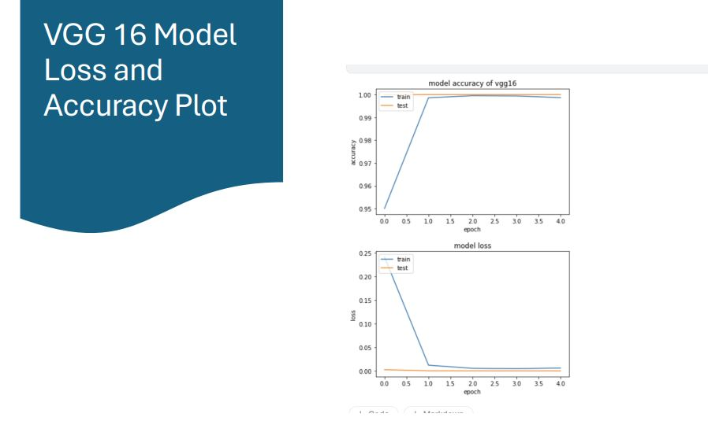
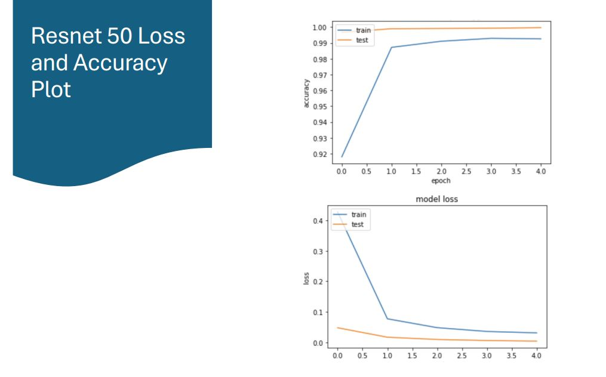
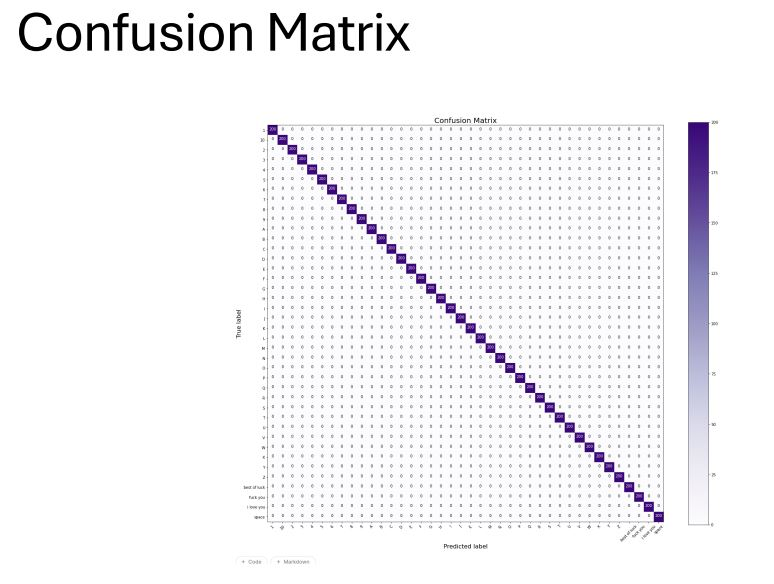

# American Sign Language (ASL) Recognition Using Transfer Learning

This repository contains the source code for an American Sign Language (ASL) recognition project. The project leverages transfer learning with pre-trained models (VGG16 and ResNet50) to detect and translate ASL fingerspelling into text. It aims to provide an accessible communication tool for the Deaf and Hard of Hearing community.

## Features

- Data preprocessing and normalization for robust image recognition.
- Training and evaluation using pre-trained deep learning models.
- Support for VGG16 and ResNet50 architectures.
- Visualization of model accuracy, loss, and confusion matrices.

## Prerequisites

Ensure you have the following installed:

- Python 3.8+
- TensorFlow
- Keras
- NumPy
- OpenCV
- Matplotlib
- Scikit-learn
- Pillow

Install all dependencies using:
```bash
pip install -r requirements.txt
```

## Dataset

The project uses a dataset of American Sign Language (ASL) images:

- Training set: `/kaggle/input/american-sign-language-recognition/training_set`
- Evaluation set: `/kaggle/input/american-sign-language-recognition/test_set`

The dataset consists of images of ASL letters and words, captured in diverse backgrounds and lighting conditions.

## Project Structure

- **`load_images`**: Helper function to load and preprocess images from directories.
- **Pre-trained models**: VGG16 and ResNet50 architectures fine-tuned for the ASL dataset.
- **Normalization**: Normalizes image pixel values to improve model performance.
- **Training**: Models are trained with categorical cross-entropy loss and accuracy metrics.
- **Evaluation**: Models are evaluated on test and evaluation datasets.
- **Visualization**: Accuracy, loss plots, and confusion matrices for both models.

## How to Use

### 1. Clone the Repository
```bash
git clone <repository_url>
cd <repository_name>
```

### 2. Install Dependencies
```bash
pip install -r requirements.txt
```

### 3. Train Models
Run the script to train both VGG16 and ResNet50 models:
```bash
python train_asl_models.py
```

### 4. Evaluate Models
Evaluate the trained models and visualize results:
```bash
python evaluate_asl_models.py
```

### 5. Make Predictions
Use the models to make predictions on new ASL images:
```python
from keras.preprocessing import image
import numpy as np

# Load image
img_path = "path_to_image.jpg"
test_image = image.load_img(img_path, target_size=(64, 64))
plt.imshow(test_image)

# Preprocess image
test_image = image.img_to_array(test_image)
test_image = np.expand_dims(test_image, axis=0)

# Predict with VGG16 model
result = vgg16_model.predict(test_image)
predicted_label = np.argmax(result)
print("Predicted Label:", predicted_label)
```

## Results

- **VGG16**: Achieved high accuracy in recognizing ASL fingerspelling.
- **ResNet50**: Demonstrated robust performance with residual learning blocks.

### Accuracy and Loss Plots



### Confusion Matrices


## Future Work

- Develop a real-time application for live ASL recognition.
- Integrate with camera access for capturing live gestures.
- Enhance model performance with additional training and tuning.

## License

This project is licensed under the MIT License. See the LICENSE file for more details.

## Contributions

Contributions are welcome! Please feel free to submit issues or pull requests to improve the project.
